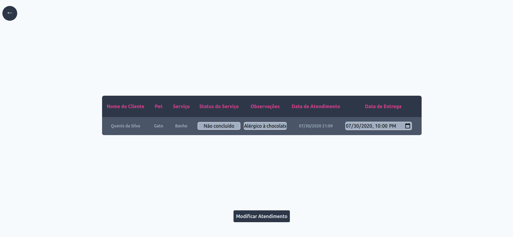
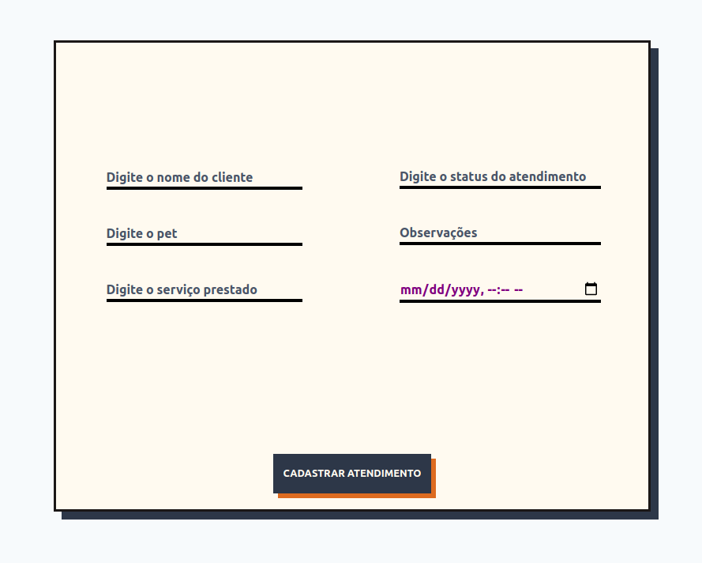
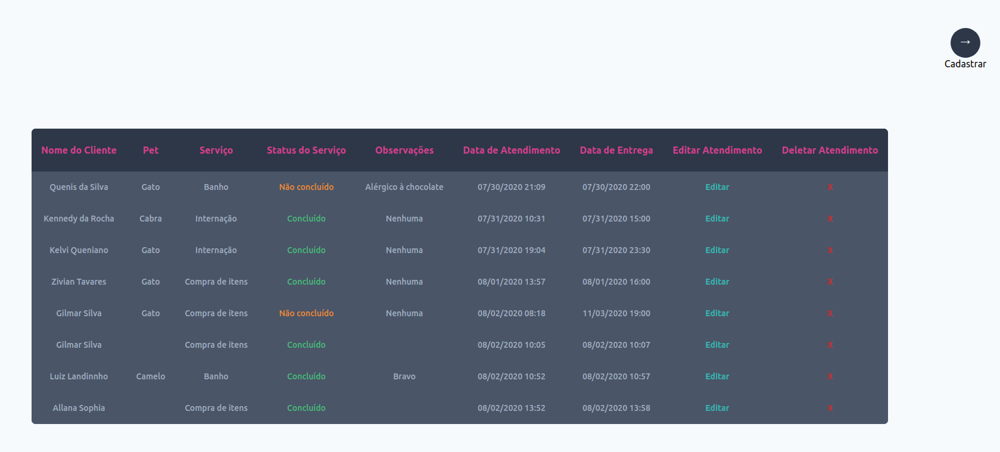

<h1 align="center">Clínica Veterinária</h1>
</img>
</img>
</img>

# Sobre o projeto

Sistema de controle de atendimentos de uma clínica veterinária.
Basicamente é uma API com Node. Frontend feito com vanilla js.

Banco de dados: <a href="https://github.com/mysqljs/mysql">MySQL NodeJS</a>
Framework css: <a href="https://tailwindcss.com/">Tailwind CSS</a>
Testes HTTP: <a href="https://insomnia.rest/">Insomnia</a>

# Rodando o projeto

Como estou usando Mysql como banco de dados, caso queira rodar o projeto, será necessário instalá-lo em seu computador.

Entre na pasta **Node API REST** e digite ```` npm install ````, isso irá baixar todas as dependências necessárias para rodar o servidor.
Após isso, digite ```` yarn dev / npm run dev ```` para iniciar o servidor na porta 3333.
Depois basta abrir o arquivo index.html ou usar um live server, como o do VS Code.

# Observações

Pretendo trazer mais funcionalidades para este sistema, logo, está incompleto no momento.
